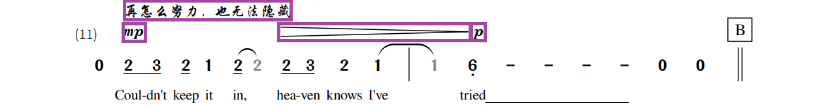

# 基于碰撞箱的精确自动布局

> 这是一个尚未实现或实装的特性设计方案。如果你有问题或者改进建议，可以在 GitHub Issues 或 Discussion 中提出。

尽管许多排版问题都能被 Sparks NMN 自动排版机制解决，需要手动调整的内容还是太多了。此外，一些地方的间距等设置可能也不是那么合理。自动排版机制需要一次深刻的优化，使标记符号、行间距等参数更加智能，这样才能保证用户的注意力聚焦于内容上。

为了保证用户掌握乐谱的空间感，乐谱分行和小节宽度调整仍然手动进行。

## 小修改

### 小节线渲染机制变更

小节线将不再使用音乐字体渲染，而是改用图形。这是为了保证不同高度的乐谱中小节线的外观能保持一致。这还可以保证曲谱行的高度是精确的。

一般声部的曲谱行高度将被缩减（至音符高度的 2.2 倍，音符大小不变），这样可以使乐谱略微紧凑一点，但不会对空间感造成太大影响。

新的属性 `section_height_mult=2.2 (x)` `tab_line_height=0.8 (em)` 将用于控制曲谱行的高度。

### 连音线渲染机制变更

连音线将不再使用三个组件渲染，而是渲染为一条完整的线。线的形态将变为抛物线。

### 小节序号位置变更

小节序号不会再占据每行第一小节的上方空间，而是右对齐于第一小节起始坐标（不扣除边距）处。

### 装订线左边界

新的装订线左边界机制将改变一切“左对齐”内容的对齐位置，而非仅仅是乐谱部分。

## 列空间分配

列空间分配仍然使用之前的机制，但是部分细节有所改动。

### 小节线类型减宽

有的小节线可能很宽，因此小节线占据的宽度应当从小节空间中剔除。

### 拍号减宽

拍号占据的额外宽度根据拍号的实际宽度确定，此外还要加上拍号与小节线的预设间距。

### 占据宽度的新内容

将考虑使插入符号和标记符号占据一定宽度。

## 预渲染组织方案

渲染将不再在一个大的画布上直接进行，而是像装配零件那样。每个零件都将记录自己内部所有碰撞箱的信息。这样，需要测量数据进行布局时，不需要再预先进行模拟。

小的零件可以继续组装成更大的，也可以在中途进行“打包”操作（合并内部所有碰撞箱）。零件最终组装到排版块（Field）级别。

## 碰撞箱

碰撞箱是贴靠坐标轴的矩形框。碰撞箱的合并，就是取能够包裹内部所有碰撞箱的最小碰撞箱。

### 基本图形的碰撞箱

标签：`element`

图形（任意多边形）的碰撞箱取能够包裹所有顶点的最小框。

文本将不再支持指定锚点位置，始终固定为左上角。

- 文本（实测高度型）的碰撞箱取实际测量得到的碰撞箱。
- 文本（固定高度型）的碰撞箱宽度取决于实际测量数据，高度固定为文本实际尺寸与固定系数的乘积。

文本居中等锚点设置改为在放置时通过微调实现。

### 小节碰撞箱

标签：`section`

小节有一个固定碰撞箱，高度由小节线的高度范围决定，宽度为小节的分配宽度（不扣除边距）。

小节碰撞箱不考虑其具体内容，空小节也有碰撞箱。

### 小节音符溢出碰撞箱

标签：`note`

对于单个音符（包括其装饰音），如果**打包的碰撞箱**在竖直方向超出小节碰撞箱，则产生小节音符溢出碰撞箱。

注：TAB 拨弦音符没有音符溢出碰撞箱。

### TAB 音符奏法记号碰撞箱

标签：`note`

TAB 音符奏法记号总是标注在最上方线的上面，这将会占据一些空间。这时奏法记号与音符联合组成碰撞箱。

### 连音线溢出碰撞箱

标签：`connector`

连音线图形额外具有自己的碰撞箱，这是因为连音线几乎一定会超出小节高度范围。

### 小节序号、连谱号

标签：`ordinal`

连谱号没有碰撞箱，其效果由小节宽度边界实现。

小节序号的碰撞箱为小节序号文本的实测高度碰撞箱。

由于显示机制的变更，小节序号碰撞箱不会被参考。

### 标记符号碰撞箱

标签：`annotation`

#### 一般文本类标记符号

一般文本类符号采用竖直居中放置的方式，高度改写为某个固定值。

#### TAB 和弦标记符号

TAB 和弦标记的碰撞箱取所有元素的打包碰撞箱，其中和弦名文本采用实测高度。

### 歌词行

歌词行为所有歌词内容的合并，歌词内容的测量采用固定高度，以此实现歌词回落机制。

歌词行含有替代旋律或标记符号时，替代旋律的小节与括号单独进行合并，标记符号不进行合并。

> 注意：歌词标点的测量仍然采用半角替代全角的方式。

## 标记符号的可移动性

### 紧密关联型标记符号行

许多情况下标记符号是“散装的”，可以在竖直方向上任意调节而不影响其效果。但是，有的标记符号行具有紧密的逻辑关系（例如和弦标记或力度标记），如果不排列在同一个水平线上，将影响可读性。此类标记行称为紧密关联的标记行，在排版中有特殊的处理手段。

### 可水平移动的标记符号

可水平移动的标记符号有两种：

- **位置无关的标记符号** 记号 `[*]`，表示标记符号可在小节内任意水平滑动，不会对含义有太大影响。
- **可滑动的标记符号** (仅在紧密关联行中有效)两种和弦标记都是可滑动的标记符号，在满足覆盖目标位置的情况下可以向左滑动。如果发生向左滑动，下方需要添加一个小三角形箭头标出目标位置。

## 行内布局机制

行内布局的“行”指的是乐谱行，也就是页面排列的最小单位。乐谱行的构建需要这样的过程：

- 曲谱行本体构建，并记录碰撞箱。
- 标记符号与小节线属性按照一定顺序构建，添加到曲谱行的合适位置。
- 歌词行按与曲谱行类似的逻辑构建。
- 歌词行添加到曲谱行下方的合适位置，合并后构成声部。
- 声部间按一定规则确定间距并合并，成为曲谱行。
- 曲谱行上方标记跳房子记号、小节序号，左边标注连谱号。

### 标记符号添加机制

对于非紧密的标记符号行，按下面流程构建并添加：

- 构建每个标记符号并确定位置。
- 对于每个标记符号：
  - 先将高度确定在小节上边缘的最低可放置处。
  - 如果通过左右滑动，标记符号也不可能不与其他碰撞箱冲突时，就将标记符号向上滑动，直到能找到可放置的位置为止。

对于紧密的标记符号行，按下面流程构建并添加：

- 构建每个标记符号并确定位置。
- 将标记符号固定贴靠到同一高度上，组成整体（但不合并碰撞箱）。
- 将能够滑动的标记符号适当滑动，使得标记行内不发生冲突。
- 将标记行的高度确定在小节上边缘的最低可放置处。
- 如果标记符号与其他碰撞箱冲突，就将标记符号向上滑动，直到找到可放置的位置为止。

对于小节线属性：

- 标定条件反复、多次反复、迭代数重置的属性在添加所有标记符号之前**合并在一起**处理。
- 变更音乐属性（拍号除外）、添加自定义文本类的标记符号在添加完最后一个含和弦标记的行后**合并在一起**处理。
- 段落标记、结构记号在添加所有标记符号后**合并在一起**处理。
- 作为上方属性的结构记号改为在**下方**显示。

添加小节线属性的机制与添加单个标记符号类似。

> 鼓点行或者非最前的紧凑行中不处理标记符号和属性，拍号除外。

### 鼓点行包边

鼓点行的边框在上述过程完成后再添加，以保证没有音符超出鼓点行的边界。

### 歌词行添加机制

对于每个歌词行：

- 将歌词行的基线放置在上一个歌词行的实际基线位置。（如果是第一个，则放置在曲谱下边界处）
- 向下移动歌词行，直到其不再发生冲突。

### 声部间的间距

#### 一般声部行之间

一般声部行之间，间距应当使得最近的两个碰撞箱距离不小于某个特定的值。如果并没有这么近的碰撞箱，则间距可以直接设定为 $0$。

#### 紧凑声部或鼓点声部之间

此类情况不考虑内部碰撞箱情况，直接将间距设置为 $0$。

## 行间距的决定

乐谱行的最小间距按照与声部间间距类似的机制处理，但是实际间距可能根据页面的需要被增大。

## 实现要点
